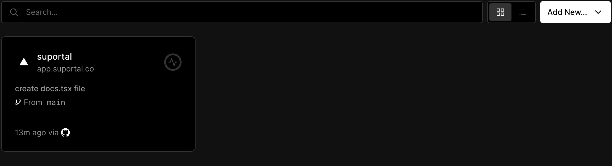
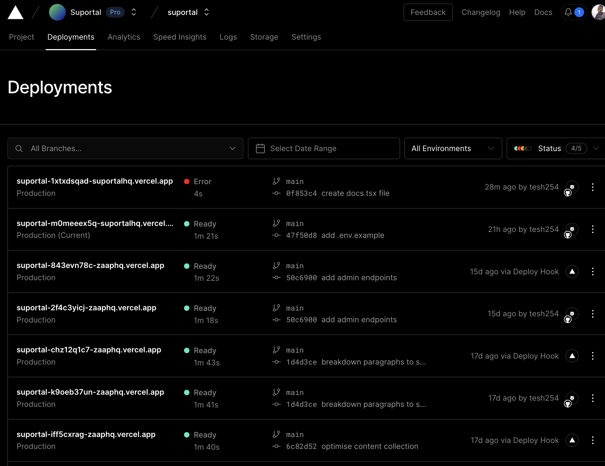
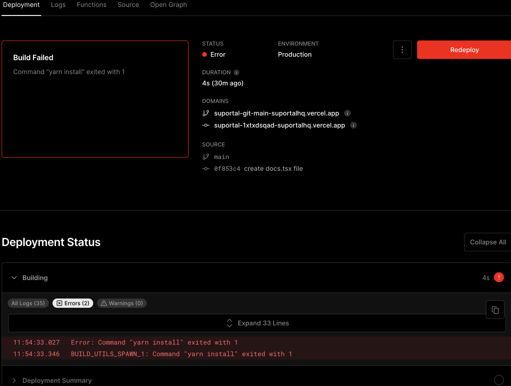

# Suportal

This is the repo for Suportal frontend and Nextjs API

## Files & Contents

`components/api-key`
- houses api key component code to provide their own `api-key` on the `developer` plan and calls the `/api/billing/save-api-key` endpoint

`components/auth-form`
- houses the generic authentication form that enables log in and sign up, mostly interacts with `/api/login` and `/api/signup`

`components/bot-form`
- houses the chatbot creation form and has a child component in `components/paths` file to list out all links fetch from url provided, train Suportal on the content created, get links from the link provided tied to the chatbot

`components/button`
- contains custom button component

`components/counter` 
- holds the purple component above billing plans in the `/billing` page, shows a count of the chat usage

`components/input`
- contains custom input and textarea component

`components/layout`
- overlays the entire page to enable smooth transitions between pages

`components/link`
- component that houses a single website path link with information if its trained or not

`components/navbar`
- holds the navbar component seen when a user logs in

`components/plans`
- renders all plans created under Suportal on Stripe

`components/tabs`
- contains the tab component

`lib/embed-string`
- exports a string that is used to load the iframe widget

`lib/gpt-parser`
- handle streaming from openai, decodes and encodes the response to have the typing effect on responses

`lib/identify`
- exports a function that generates a user's device fingerprint

`lib/sanitizer` 
- cleans long strings by removing emojis, unicode charactes and new lin characters

`lib/stripe`
- exports the stripe class instantiated

`pages/api/ai/embed`
> [POST]: `/api/ai/embed`
- get best context to inject in prompt through cosine similarity, 

`pages/billing/chat-counter`
> [GET]: `/api/billing/chat-counter`
- get a chatbot chat's counter

`pages/billing/checkout`
> [POST]: `/api/billing/checkout`
- generates the url to redirect to stripe checkout on the specific checkout

`pages/billing/create`
> [POST, GET]: `/api/billing/create`
- create billing record on database, and fetch it

`pages/billing/index`
> [GET]: `/api/billing`
- get billing tried to chatbot

`pages/billing/plans`
> [GET]: `/api/billing/plans`
- get stripe plans created on the dashboard

`pages/billing/save-api-key`
> [POST]: `/api/billing/save-api-key`
- save own api to the database

`pages/billing/subscribe`
> [POST]: `/api/billing/subscribe`
- creates a subscription tied to a customer

`pages/chat/index`
> [POST]: `/api/chat`
- send prompt to openai to get a response that will rendered in chat

`pages/api/chat/limit`
> [GET]: `/api/chat/limit`
- used to check if a chat has exceeded their chat counter

`pages/api/chat/tracker`
> [POST]: `/api/chat/tracker`
- updates chat usage table with new chats to update the counter

`pages/api/chatbot/links/[chatbot_id]`
> [POST]: `/api/chatbot/links/[chatbot_id]`
- get all links tied to the chatbot

`pages/api/chatbot/index`
> [GET,POST]: `/api/chatbot`
- get chatbot tied to account

`pages/api/cron`
- subscription cron endpoint to check if billing should be reset based on billing expiry date

`pages/api/events/links/[chatbot_id]`
> [POST]: `/api/events/links`
- webhook that contains links for a website

`pages/api/events/stripe`
> [POST]: `/api/events/stripe`
- webhook for stripe payments

`pages/api/widget/[identifier]`
> [GET]: `/api/widget/[identifier]`
- returns javascript in mimetype `application/javascript` based on the chatbot

`pages/api/get-content`
> [POST]: `/api/get-content
- makes a request to the scrapper to get content for all links tied to a website link for a chatbot

`pages/api/get-links`
> [POST]: `/api/get-links`
- makes a request to the scrapper to get links for a website link tied to a chatbot

`pages/widget/[identifier]`
- this is the page loaded in the iframe within the widget

`pages/billing.tsx`
- this page renders all the pricing plans, chat counter and also ability to updgrade plan and api key

`pages/demo.tsx`
- this page renders a demo chat for users to try it out

`pages/docs.tsx`
- this page instantiates the swagger ui docs for the api endpoints

`pages/go-to-email.tsx`
- this informs the user to check email after signing up to verify their account

`pages/index.tsx`
- this page renders the dashboard, where the links for the chatbot tied are shown and the chabot form

`pages/login.tsx`
- this is the login page

`pages/signup.tsx`
- this is the signup page

`pages/verify.tsx`
- this is the page the users sees when they click on the verify link received in their email

## Suggestions
- instead of storing fingerprint with the data collected for each unique user, a better would be generate a sha256 checksum
- updating the scrapper code to use `google/transformer` model or `openai/tiktoken` to reduce openai pricing to generate embeddings
- adding proper auth for admin api endpoints and creation of an admin ui to better help users whenever issues arise

## How to run

- clone the repo
- install dependencies, we use `yarn` `berry` version `yarn install`
- create `.env.local` and copy over contents of `.env.example` and provide their values
- run development server `yarn dev`

## Deployment
- if on a new branch, and you push a commit and raise a PR, vercel will automatically detect changes and deploy a preview url, for review and also preview feedback ui on the pages for better ui feedback
- on merge to `main`, vercel will deploy the latest commit automatically
- when you push directly to `main` vercel might not deploy the commit, so the easiest way is to use a `deploy-hook`. The curl request below does that
```bash
curl -X POST https://api.vercel.com/v1/integrations/deploy/prj_N4lXDKNFkk71PAdnYMAqnWWRdaht/qamtWLdRa8
```
- to check for errors visit the vercel organization dashboard [link](https://vercel.com/suportalhq)

- click on the suportal card, and the deployments tab

- click on the deployment with an error, you will see the logs below


## How does the context injection works in Suportal
- refer to this [chart](https://whimsical.com/suportal-embeddings-creation-process-HPUXk25GdwFwH68MGrQeGw)